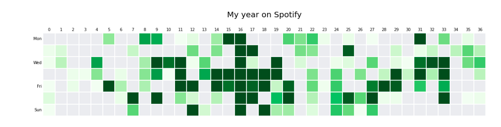

# Analísis de datos con tu historial de Spotify

En este repositorio encontraras la forma de sacar provecho a tus historial de reproducción de Spotify (TUS DATOS) y podrás graficarlos al estilo de las gráficas de Github.

Para obtener tus datos de Spotify tendrás que dirigirte a esta dirección [Spotify](https://www.spotify.com/) y solicitar la descarga de tus datos.
El proceso puede tardar varios días. La descarga de mis datos demoró una semana. Te enviarán un correo avisandote que ya los puedes descargar.

Una vez descargados podrás comenzar a explorar tu información.

## Objetivo:

Explorar la información de Spotify recopila cuando usamos su aplicación para obtener una gráfica que nos dará información sobre que diás de la semana hemos utilizado más la aplicación.

## Resultado:

